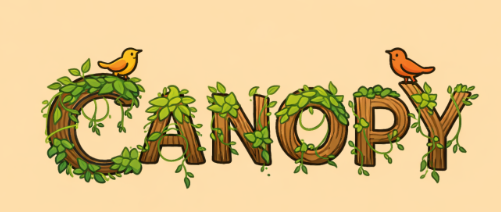

# Canopy Engine

---

  

## 🌲 Node-based declarative game engine built in Kotlin 🌲 

 

[//]: # ([![Crates.io]&#40;https://img.shields.io/crates/v/bevy.svg&#41;]&#40;https://crates.io/crates/bevy&#41;)
[//]: # ([![Downloads]&#40;https://img.shields.io/crates/d/bevy.svg&#41;]&#40;https://crates.io/crates/bevy&#41;)
[//]: # ([![Docs]&#40;https://docs.rs/bevy/badge.svg&#41;]&#40;https://docs.rs/bevy/latest/bevy/&#41;)
[//]: # ([![CI]&#40;https://github.com/bevyengine/bevy/workflows/CI/badge.svg&#41;]&#40;https://github.com/canopyengine/canopy/actions&#41;)

---

**[Canopy](https://github.com/canopyengine/canopy) is a node-based, declarative game engine built in 
[Kotlin](https://kotlinlang.org/), on top of the [LibGDX](https://libgdx.com/) framework and inspired by [Godot](https://godotengine.org).** 
It's designed to be a **Kotlin-native** game engine built on **declarative** and **composition**-based principles, and to provide a **simple yet 
powerful** set of tools for developing your own games!

## ⚠️ Work in progress ⚠️

Canopy is still a work in progress, and the **current version** is still unusable. Following the next weeks, the goal will be to
release a **Headless Version** capable of running the core features in the **terminal**.

### Previous Stable Version(As part of a project, not yet a library)

For documentation purposes, the **latest stable version** of **Canopy** was as part of code on a **LibGDX-Kotlin game project**.
There, we designed the first versions of the following features:

### Scenes and Nodes (Welcome Godot lovers)
Every level, character, object, UI, menu, and even text can be described as a Scene. Think of it as a container for a part
of your game. 

Equivalent to:
* **_Unity and Unreal_**: levels/prefabs 
* **_Godot_**: scenes

A scene is made of a number of components is a **tree-hierarchy**, so you can have **children-parent** relations between
them. These components are called **Nodes**!

Equivalent to:
* **_Unity_**: GameObjects with Components
* **_Unreal_**: Actors/Components hierarchy
* **_Godot_**: nodes

Each node has its own purpose, so you can have:

* **Animation** nodes - for managing and playing animations 🎞️
* **Physics** nodes - for handling things like collisions, area detections, or even ray-casts 💥
* **Visual** nodes - for displaying things like sprites
* **Much more**!
* Even you can create **custom nodes** if need be!

You can then mix-and-match nodes to form the structure of your scene

**Minimum Supported Kotlin Version**: **2.3.10**

> **Canopy** development aims to follow **Kotlin**'s improvements, so the minimum 
supported version will usually be the latest **stable** version.

---

# License

